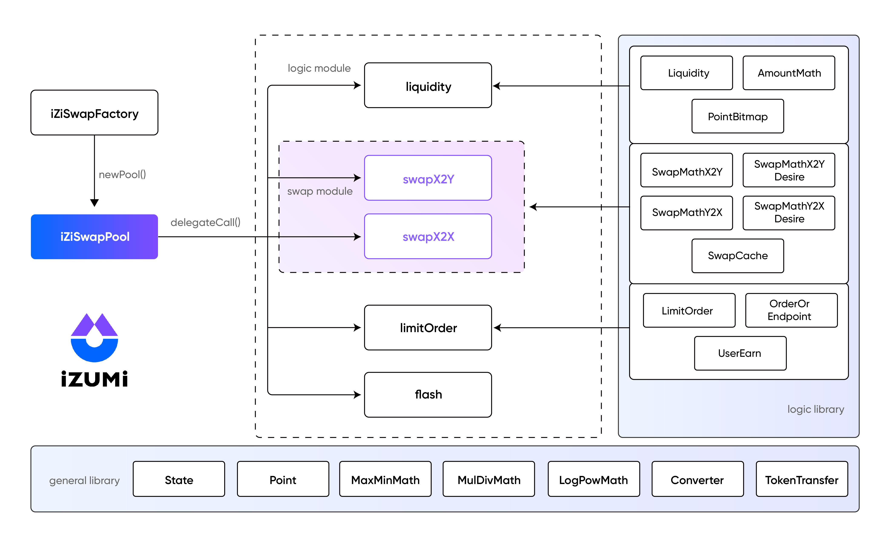

# iZiSwap-core

  

Contracts for iZiSwap core. 
[iZiSwap Periphery](https://github.com/izumiFinance/iZiSwap-periphery)  contracts are suggested entrances to interact with the core contracts.  

## Overview

  

Incorporated with the innovative Discretized-Liquidity-AMM model, iZiSwap is a next-generation DEX to maximize capital efficiency by realizing Limit Order in a decentralized way.

Design and some details can be found in the paper [iZiSwap: Building Decentralized Exchange with Discretized Concentrated Liquidity and Limit Order](https://github.com/izumiFinance/izumi-swap-core/blob/main/whitepaper/iZiSwap:%20Building_Decentralized_Exchange_with_Discretized_Concentrated_Liquidity_and_Limit_Order.pdf).